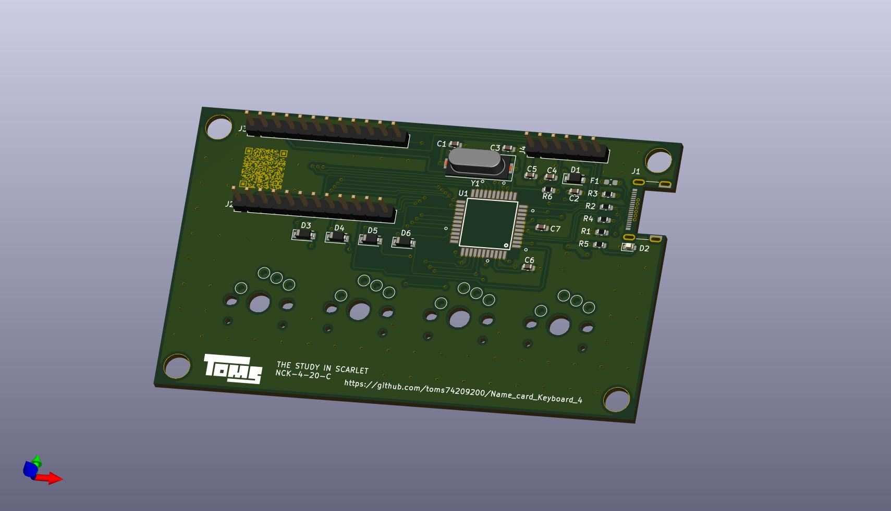

# Study 4 Scarlet

- 4 Keyboard
- Kailh Choc type
- Business card size(91mm x 55mm)
- arduino(Pro micro) compatible
- USB type-C interface

## Usage

See [User guide (English)](./docs/user_guide_en.md) ([日本語](./docs/user_guide_ja.md)). 

## License

MIT License

## Author

[toms74209200](<https://github.com/toms74209200>)