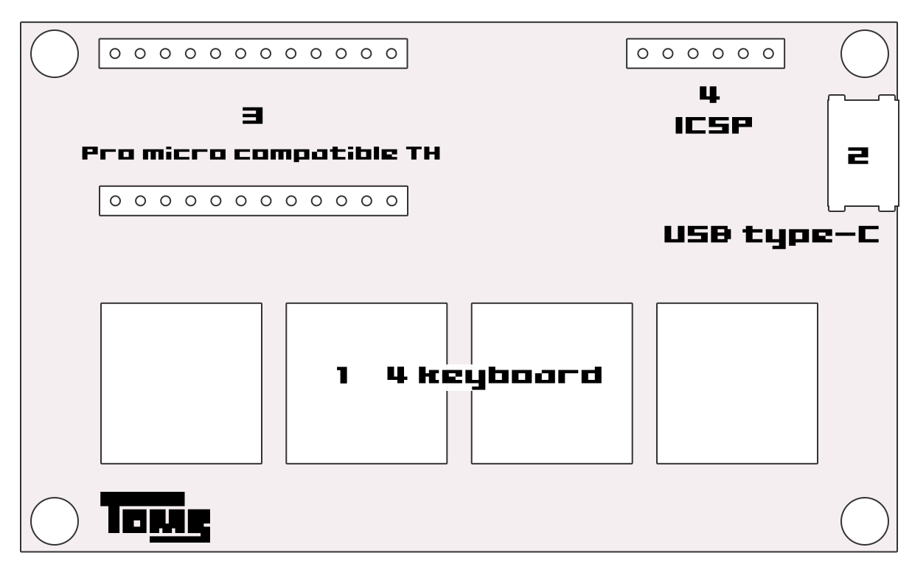

# User guide

## Overview

1. 4 Keybord
2. USB type-C connector
3. Arduino (Pro micro) compatible thrue holes
4. ICSP interface

## Use for Keyboard

## Use for Arduino(Pro micro)

## Schematic

See [name_card_keyboard.pdf](../pcb/name_card_keyboard.pdf).

### Pin assignment

#### 3. Arduino (Pro micro) compatible thrue holes

This thrue holes are compatible sparkfun's Pro micro pins. Refer to the link below for details

- [sparkfun Pro micro product page](https://www.sparkfun.com/products/12640)
    https://www.sparkfun.com/products/12640
- [sparkfun Pro micro Graphical Datasheet](https://cdn.sparkfun.com/assets/f/d/8/0/d/ProMicro16MHzv2.pdf)
    https://cdn.sparkfun.com/assets/f/d/8/0/d/ProMicro16MHzv2.pdf

**CAUTION** pins:`4`, `5`, `A2`, `A3` share with keybord switch signals.

| Down-side | Up-side |
| --------- | ------- |
| TXO       | RAW     |
| RXI       | GND     |
| GND       | RST     |
| GND       | VCC     |
| 2         | A3      |
| 3         | A2      |
| 4         | A1      |
| 5         | A0      |
| 6         | 15      |
| 7         | 14      |
| 8         | 16      |
| 9         | 10      |

#### 4. ICSP interface

ICSP (In-Circuit serial programing) pins are used for programing arduino boot loader.

| pin  | Signal |
| ---- | ------ |
| 1    | 5V     |
| 2    | GND    |
| 3    | RST    |
| 4    | SCK    |
| 5    | MOSI   |
| 6    | MISO   |

## 