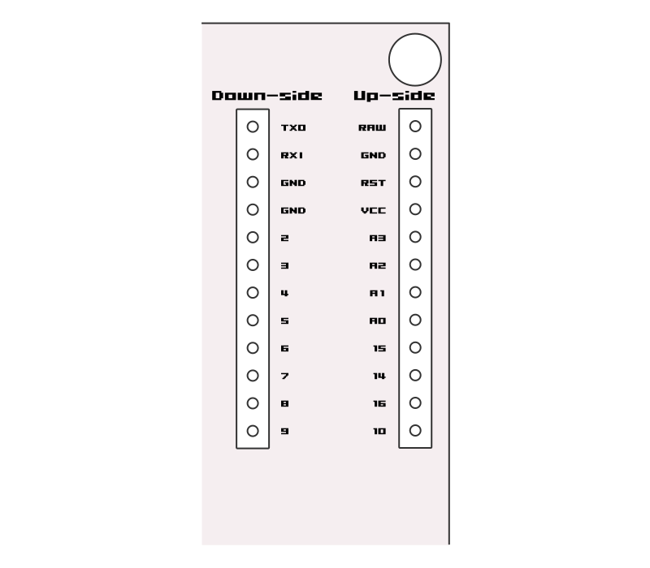

# User guide

## Overview


1. 4 Keybord
2. USB type-C connector
3. Arduino (Pro micro) compatible thrue holes
4. ICSP interface

## USB type-C

The board has a USB type-C connector as a interface. But it does not work with type-C to type-C cable. You must use type-C to type-A cable.

## Use for Keyboard

The board has programed keyboard firmware(QMK firmware). The keymap are allocated in order of `Cmd`-`z`, `Cmd`-`x`, `Cmd`-`c`, `Cmd`-`v` from the left.

### development environment

To change the keymap, it is necessary to build the development environment. For details, see the following.

[Setting Up Your QMK Environment - Setup - QMK](https://beta.docs.qmk.fm/tutorial/newbs_getting_started#setting-up-your-qmk-environment)

### To change keymap

Changing the keymap needs [the repository of QMK firmware](https://github.com/qmk/qmk_firmware). Do git clone the repository.

```bash
$ git clone git@github.com:qmk/qmk_firmware.git
```

Run `./util/qmk_install.sh`, `make git-submodule` if you need to build it.

The source codes for the keyboard's firmware can be found in [`./firmware/s4scarlet/`](../firmware/s4scarlet). Please put the source codes  under `keyboards/` in the QMK firmware repository.

```bash
s4scarlet$ mv ./firmware/s4scarlet/ /qmk_firmware/keyboards/
```

The keymap for the keyboard are located under [`./firmware/s4scarlet/keymap/`](../firmware/s4scarlet/keymap). To edit the `defualt` keymap, you can edit `keymap.c`. (Not recommended). To prepare new keymap and edit it, use the following command.

```bash
qmk_firmware$ ./util/new_keymap.sh s4scarlet <keymap_name>
```

If you prepare new keymap, a directory: `./firmware/s4scarlet/keymap/<keymap_name>` will be created. You can edit `keymap.c` that is in this directory to edit the keymap.

You use the `make` command as to build the firmware.

```bash
qmk_firmware$ make s4scarlet:<keymap_name>
```

Programing the firmware also uses the `make` command.

```bash
qmk_firmware$ make s4scarlet:<keymap_name>:avrdude
```

When you execute the above, a termnal displays "Detecting USB port, reset your controller now...'' as below. At this time, reset the board by shorting the ground pin and the reset pin on the board.

```bash
qmk_firmware$ make s4scarlet:<keymap_name>:avrdude
QMK Firmware 0.9.50
Making s4scarlet with keymap default and target avrdude
~
 * The firmware size is fine - 15018/28672 (52%, 13654 bytes free)
Detecting USB port, reset your controller now...
```

At this time, it may stop working (often), so in that case, you terminate command (`Ctrl`-`c`) and try again.

### More details

For more details, please refer to the official QMK firmware documentation.

[Quantum Mechanical Keyboard Firmware](https://docs.qmk.fm/#/?id=quantum-mechanical-keyboard-firmware)

## Use for Arduino(Pro micro)

The Arduino boot loader is programed in the board, so it can be used as it is as an Arduino(Pro micro). Please refer to the [Schematic](#sch) section.

## Schematic<a name="sch"></a>

See [s4scarlet.pdf](../pcb/s4scarlet.pdf).

### Pin assignment

#### 3. Arduino (Pro micro) compatible thrue holes

This thrue holes are compatible sparkfun's Pro micro pins. Refer to the link below for details

- [sparkfun Pro micro product page](https://www.sparkfun.com/products/12640)
    https://www.sparkfun.com/products/12640
- [sparkfun Pro micro Graphical Datasheet](https://cdn.sparkfun.com/assets/f/d/8/0/d/ProMicro16MHzv2.pdf)
    https://cdn.sparkfun.com/assets/f/d/8/0/d/ProMicro16MHzv2.pdf

**CAUTION** pins:`4`, `5`, `A2`, `A3` share with keybord switch signals.



| Down-side | Up-side |
| --------- | ------- |
| TXO       | RAW     |
| RXI       | GND     |
| GND       | RST     |
| GND       | VCC     |
| 2         | A3      |
| 3         | A2      |
| 4         | A1      |
| 5         | A0      |
| 6         | 15      |
| 7         | 14      |
| 8         | 16      |
| 9         | 10      |

#### 4. ICSP interface

ICSP (In-Circuit serial programing) pins are used for programing arduino boot loader.

| pin  | Signal |
| ---- | ------ |
| 1    | 5V     |
| 2    | GND    |
| 3    | RST    |
| 4    | SCK    |
| 5    | MOSI   |
| 6    | MISO   |

## 