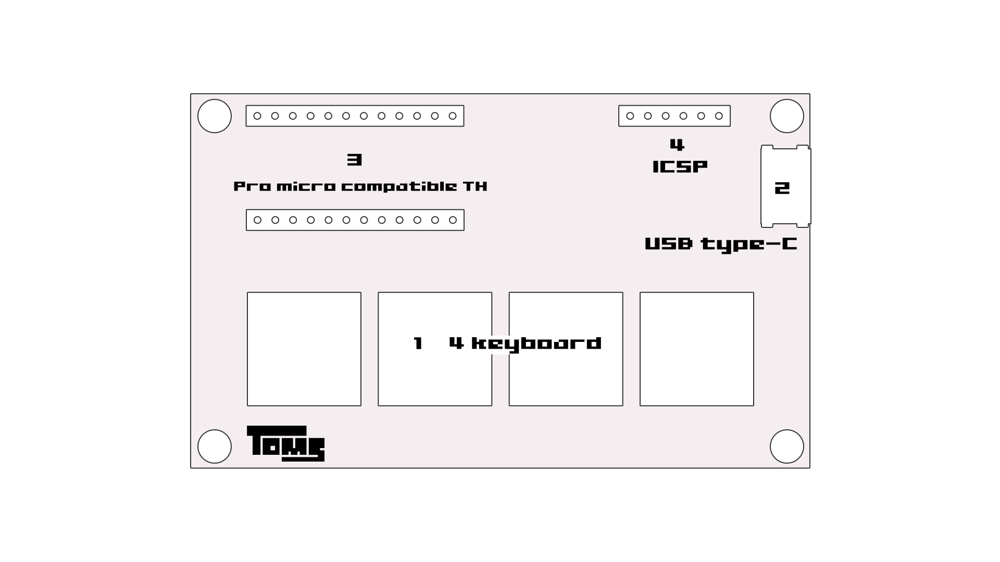
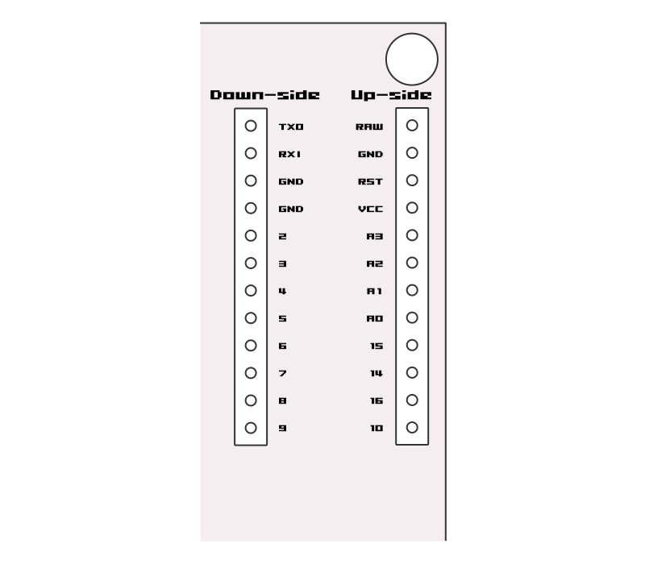

# ユーザーガイド

## 概要



1. 4キーボード
2. USB type-C コネクタ
3. Arduino (Pro micro) 互換スルーホール
4. ICSP インターフェイス

## USB type-C コネクタ

インターフェースとしてUSB type-C（メス）コネクタがあります. しかしtype-C - type-Cケーブルは対応していません. 必ずtype-C - type-Aケーブルを使用してください.

## キーボードとして使う

装置にはあらかじめキーボードのファームウェア(QMK firmware)が書き込まれています. キーマップは左から`Cmd`-`z`, `Cmd`-`x`, `Cmd`-`c`, `Cmd`-`v` となっています.

### 開発環境

キーマップを変更する場合, 環境の構築が必要になります. 詳細は以下を確認ください.

[Setting Up Your QMK Environment - Setup - QMK](https://beta.docs.qmk.fm/tutorial/newbs_getting_started#setting-up-your-qmk-environment)

### キーマップの変更

キーマップの変更は[QMK firmware のリポジトリ](https://github.com/qmk/qmk_firmware)をクローンして行います.

```bash
$ git clone git@github.com:qmk/qmk_firmware.git
```

必要であれば, `util/qmk_install.sh`, `make git-submodule`  などを実行してビルドできるようにしてください.

このキーボードのファームウェアに関するソースコードは [`./firmware/s4scarlet/`](../firmware/s4scarlet) 以下にあります. これをQMK firmwareのリポジトリの `keyboards/` 以下に設置してください.

```bash
s4scarlet$ mv ./firmware/s4scarlet/ /qmk_firmware/keyboards/
```

このキーボードのキーマップは [`./firmware/s4scarlet/keymaps/`](../firmware/s4scarlet/keymaps) 以下にあります. `defualt` のキーマップを編集する場合は `keymap.c` を編集してください（推奨しません）. キーマップを新たに用意して編集するには以下のコマンドを利用します.

```bash
qmk_firmware$ ./util/new_keymap.sh s4scarlet <keymap_name>
```

新たにキーマップを用意した場合は`./firmware/s4scarlet/keymaps/<keymap_name>` が作成されます. このディレクトリの`keymap.c` を編集してください.

ファームウェアのビルドは `make` コマンドで実行します.

```bash
qmk_firmware$ make s4scarlet:<keymap_name>
```

またファームウェアの書き込みも同様に `make` コマンドを使用します.

```bash
qmk_firmware$ make s4scarlet:<keymap_name>:avrdude
```

上記を実行すると以下のように「Detecting USB port, reset your controller now...」と表示されます. このとき基板上のグラウンドピンとリセットピンを短絡して, 装置をリセットしてください.

```bash
qmk_firmware$ make s4scarlet:<keymap_name>:avrdude
QMK Firmware 0.9.50
Making s4scarlet with keymap default and target avrdude
~
 * The firmware size is fine - 15018/28672 (52%, 13654 bytes free)
Detecting USB port, reset your controller now...
```

このときそのままそのまま動かなくなることが（多々）あるため, その場合は中断(`Ctrl`-`c`)して再度やり直してください.

### 参考

その他の詳細についてはQMK firmwareの公式ドキュメントを参考にしてください.

[Quantum Mechanical Keyboard Firmware](https://docs.qmk.fm/#/?id=quantum-mechanical-keyboard-firmware)

以下のリンクでもQMK firmwareの操作について解説されています.

- [QMK チートシート - Qiita](https://qiita.com/rai_suta/items/0376ed4ce6498bb85770)
- [はじめてのQMKキーマップ編集 - Qiita](https://qiita.com/marksard/items/9317949ce1da327f7436)

また類似のキーボードとして以下のビルドガイドが参考になります.

- [meishi2 keyboard ビルドガイド - たのしい人生](https://biacco42.hatenablog.com/entry/2019/08/10/185624)

## Arduino (Pro micro) として使う

装置にはあらかじめArduinoのブートローダーが書き込まれています. そのためそのままArduino(Pro micro) として使用することができます. [回路図](#sch)の項を参考にしてください.

## 回路図<a name="sch"></a>

回路図は [s4scarlet.pdf](../pcb/s4scarlet.pdf) をご覧ください.

### ピン配列

#### 3. Arduino (Pro micro) 互換スルーホール

スルーホールは sparkfun社のPro microのピンと同じ配列です. 詳細は以下のリンクを参照してください.

- [sparkfun Pro micro製品ページ](https://www.sparkfun.com/products/12640)
    https://www.sparkfun.com/products/12640
- [sparkfun Pro micro Graphical Datasheet](https://cdn.sparkfun.com/assets/f/d/8/0/d/ProMicro16MHzv2.pdf)
    https://cdn.sparkfun.com/assets/f/d/8/0/d/ProMicro16MHzv2.pdf

**注意** `4`, `5`, `A2`, `A3` ピンはキーボードスイッチと配線を共有しています.



| Down-side | Up-side |
| --------- | ------- |
| TXO       | RAW     |
| RXI       | GND     |
| GND       | RST     |
| GND       | VCC     |
| 2         | A3      |
| 3         | A2      |
| 4         | A1      |
| 5         | A0      |
| 6         | 15      |
| 7         | 14      |
| 8         | 16      |
| 9         | 10      |

#### 4. ICSP インターフェイス

ICSP (In-Circuit serial programing) はarduinoのブートローダーの書き込みに使用します.

| pin  | Signal |
| ---- | ------ |
| 1    | 5V     |
| 2    | GND    |
| 3    | RST    |
| 4    | SCK    |
| 5    | MOSI   |
| 6    | MISO   |

## 

